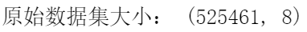
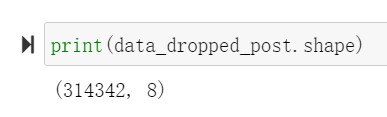
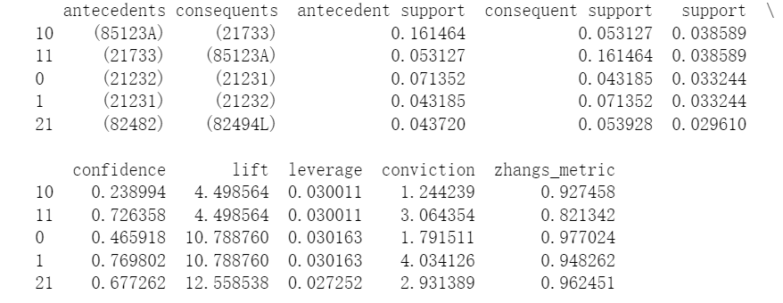

# 数据挖掘实验2——Apriori算法

温兆和 10205501432

## 数据预处理
实验前，我们删除了包含缺失项的数据，对数据进行去重，去除了对应多个商品的StockCodes，并删除了已取消的交易和邮费，最终得到了可以用于实验的数据集，它的大小大约是初始数据集的$60%$。





然后，我们把这个数据集转化为商品-交易矩阵，如果某个商品出现在某一笔交易中，那么相应的位置显示为$1$，否则就显示为$0$。由于Python中的Apriori包输入的是DataFrame类型的数据，我们还要把商品-交易矩阵的数据类型转换为DataFrame：

```python

grouped = data_dropped_post.groupby('Invoice')
unique_products = data_dropped_post['StockCode'].unique().tolist()
product_index_dict = {product: index for index, product in enumerate(unique_products)}

transaction_list = []

for name, group in grouped:
    transaction = [0] * len(unique_products)
    for index, row in group.iterrows():
        product_index = product_index_dict[row['StockCode']]
        transaction[product_index] = 1
    transaction_list.append(transaction)

transaction_df = pd.DataFrame(transaction_list, columns=unique_products)

```

## 关联规则挖掘
我们用`mlxtend`中的apriori算法对关联规则进行挖掘。由于内存不够，我们把`min_support`从$0.01$调整为$0.02$。最终打印出来的前五个关联规则如下所示：

